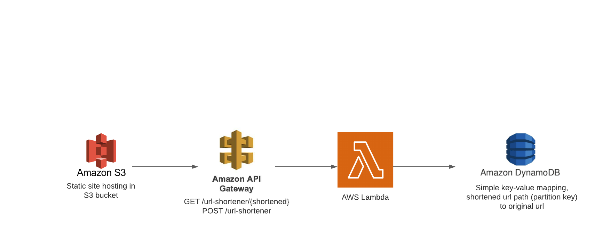

# Introduction
Thank you for taking the time to review my submission for the URL shortener coding challenge. It was an enjoyable experience which allowed me to sharpen up some tools as well as learn about how certain features are implemented. I would like to use this readme to briefly explain the high level architecture and process I employed and to discuss the resources I used.

# Accessing the Application
My application may be accessed via a [public-facing website](http://url-shortener-danner.s3-website-us-east-1.amazonaws.com), hosted in an Amazon S3 bucket. One may simply input the original url in the textbox and, upon hitting the submit button, receive the shortened url. This is displayed as a hyperlink that may be clicked to visit the original url, or copied to be pasted later into the browser.

# High Level Architecture

The architecture is relatively simple as I opted to offload a lot of infrastructural work to AWS. The main components consist of a public-facing S3 bucket to host my static site, API Gateway to handle requests for generating a shortened url from an original url and routing to the original url from the shortened url, a Lambda function to act as the serverless brains between the API and database layers, and DynamoDB to store the simple key-value pairs mapping shortened url paths to their original url counterparts.

My simple site consists of an html file with corresponding css and javascript files for basic styling and functionality. When a user enters an original url into the textbox and hits submit, a POST request is sent to the API I created with API Gateway (POST /url-shortener). Within API Gateway there is some simple translation logic going on to transform the raw request into a format more readily consumed by the Lambda function. The Lambda function is triggered by each request to the API Gateway and creates a unique and random (6 characters long) alphanumeric path, storing this random path in a DynamoDB table along with the corresponding original url. When this is performed successfully, the shortened url is returned and displayed on the client application.

On the other hand, navigating to the original url from the shortened url is slightly more involved. This is realized as a GET request with a path param representing the 6 character alphanumeric string corresponding to some original url (GET /url-shortener/{shortened}). If there exists an entry in the DynamoDB table for this short path, then the original url is fetched; if it does not exist, then a 404 error is thrown. In addition to fetching the original url, we must also return a 302 status code as well as a "Location" header to tell the browser to redirect to the original url. This is in a nutshell how my system works.

# Additional Considerations
- Support for custom shortened url paths. This should be a relatively simple feature to implement and could be realized as an additional optional textbox in the form. This input would be sent in the payload of the POST request, and if present would be used rather than a randomly generated path. In this case certain validation and sanitization would need to take place, according to the business logic.
- My implementation creates random alphanumeric paths of length 6, allowing for 62^6 or ~56.8 billion unique paths. If the scale of this system were to grow in the future and require more potential paths, this length could be captured as an environment variable to easily scale it up in the future.
- In the Lambda function I make use of many constants. I did this primarily to explicitly demonstrate these values in the code, since making them environment variables of the Lambda function may have been confusing (there is no easy way to submit this for review, as it would not technically be code). But in a production setting, it would be advisable to opt for the environment variable route. For instance, this would allow for different variables on a per-environment basis (dev, staging, prod, etc), if this level of configuration is needed. This would also be a more flexibile approach as it would not involve a code change, although it may still require a deployment to have the new environment variables discovered (I'm not 100% sure about the specifics of this).
- Because my system is not intended to be used in a production setting, the infrastructure is quite barebones and would not be suitable for extremely large traffic and load. For example, each of the main components (S3, API Gateway, Lambda, DynamoDB) currently exists only in a single region within AWS (us-east-1). Some improvements could be made by having duplicate instances in other regions to minimize the roundtrip made by requests. Even within regions there could be multiple instances of a service, with an Elastic Load Balancer strategically routing requests to manage the load on any single server. From a database perspective, overall query performance will suffer as the size of the table grows; in this case we can shard the database to spread the load across multiple servers. A reasonable sharding tactic could be to place records in buckets based off of a lexographical ordering of their shortened path (the partition key), e.g. "000000" through "999999" in one bucket, "aaaaaa" through "gggggg" in another bucket, etc.
- You may be thinking to yourself "Wow, this url shortener sure does result in quite a long url!" You would be correct, but this is strictly due to how API Gateway creates the domain name by default. Without going through a separate convoluted process of buying a domain and registering it within API Gateway, I am unable to achieve a neat and clean url such as "www.bit.ly/ABC123" but for the sake of this project please consider the shortened path rather than the long API uri.

# Resources Used
- [Google documentation on URL redirects](https://developers.google.com/search/docs/advanced/crawling/301-redirects)
- [How to return a 302 with Location header using API Gateway and Lambda](https://kennbrodhagen.net/2016/04/02/how-to-return-302-using-api-gateway-lambda/)
- [How to change the HTTP status code returned by API Gateway](https://stackoverflow.com/questions/31329495/is-there-a-way-to-change-the-http-status-codes-returned-by-amazon-api-gateway)